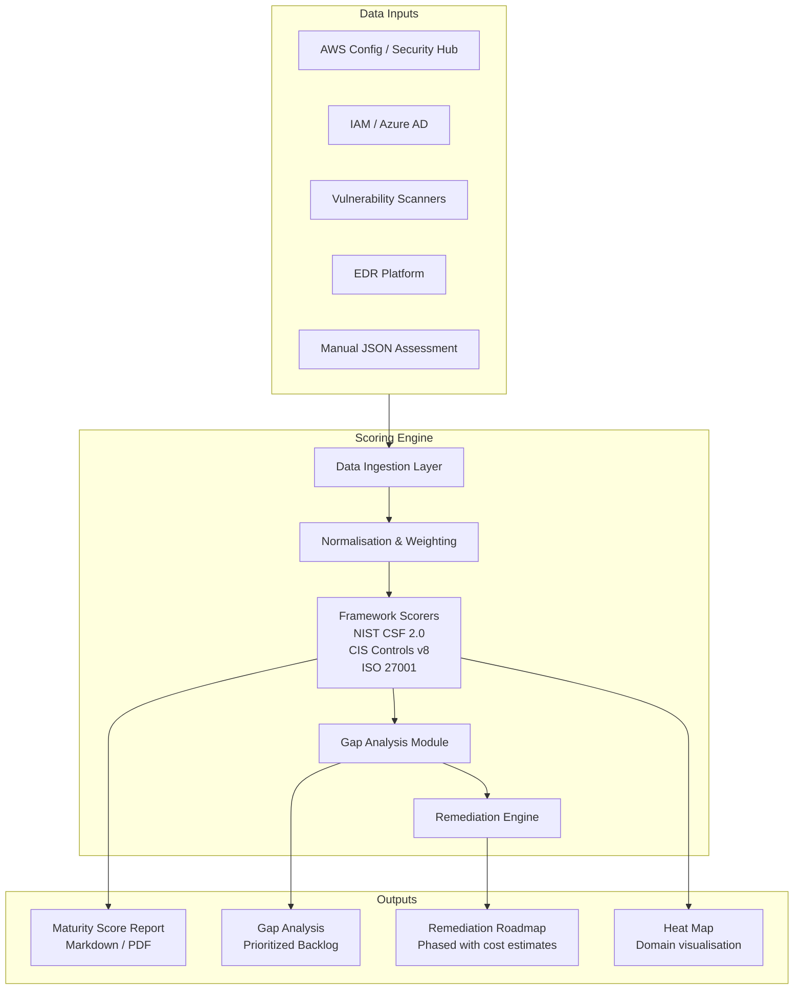
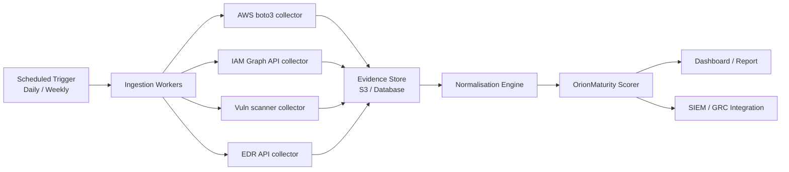

# Framework Architecture

## System Overview

OrionMaturity is a data-driven security program maturity scoring engine. It replaces manual, interview-based assessments with automated scoring from real data sources, producing quantitative maturity scores, gap analysis, and prioritized remediation roadmaps.

---

## Architecture Diagram



---

## Component Design

### Data Ingestion Layer
Collects evidence from authoritative data sources rather than relying on interviews. Each source maps to one or more maturity domains.

| Source | Integration | Domains Covered |
|--------|-------------|-----------------|
| AWS Config / Security Hub | boto3 API | PROTECT, DETECT |
| IAM / Azure AD | Graph API / SCIM | PROTECT — Identity |
| Vulnerability Scanners | REST API | IDENTIFY, PROTECT |
| EDR Platform | Vendor API | DETECT, RESPOND |
| SIEM / Log Platform | REST API | DETECT |
| Manual JSON | File input | All (fallback) |

### Scoring Engine
Three independent framework scorers share the same CMM-aligned 1–5 scale and scoring conventions, enabling cross-framework comparison.

```
Input JSON
    │
    ├── nist_csf scorer  ──► weighted function scores ──► overall NIST score
    ├── cis_v8 scorer    ──► weighted control scores  ──► overall CIS score
    └── iso_27001 scorer ──► weighted theme scores   ──► overall ISO score
                                        │
                                  Gap Analysis
                                        │
                              Remediation Prioritization
                                        │
                                  Report Generator
```

### Weighting Methodology

**NIST CSF 2.0 — Function weights:**

| Function | Weight | Rationale |
|----------|--------|-----------|
| GOVERN   | 20%    | Foundation — without governance, other controls are unsustainable |
| IDENTIFY | 15%    | You cannot protect what you cannot see |
| PROTECT  | 25%    | Largest surface area; most controls live here |
| DETECT   | 15%    | Detection capability determines dwell time |
| RESPOND  | 15%    | Response quality determines breach impact |
| RECOVER  | 10%    | Resilience — important but dependent on the above |

**CIS Controls v8 — Weighted by IG and criticality:**
- IG1 controls weighted higher (essential hygiene; highest ROI per dollar)
- IG2/3 controls weighted proportionally lower

**ISO 27001 — Theme weights:**
- A.8 Technological Controls: 45% (largest Annex A section; highest technical risk)
- A.5 Organizational Controls: 30% (governance foundation)
- A.6 People Controls: 15%
- A.7 Physical Controls: 10%
- Annex A vs. Clauses: 70% / 30% split

---

## Scoring Pipeline (Code)

```
engine/
├── scorer.py              # Entry point + framework orchestration
├── report.py              # Markdown report generator
└── frameworks/
    ├── nist_csf.py        # Domain/subdomain definitions + target scores
    ├── cis_controls.py    # 18 controls + IG mapping + target scores
    └── iso_27001.py       # Annex A themes + clauses + target scores
```

**Data flow:**
1. `scorer.py` reads JSON input
2. Passes to framework-specific scorer (`score_nist_csf`, `score_cis_v8`, `score_iso_27001`)
3. Each scorer applies weights, calculates domain and overall scores
4. Gaps computed as `target - actual` per sub-domain
5. `report.py` receives `FrameworkResult` and renders markdown

---

## Future Architecture: Automated Ingestion

The current implementation supports manual JSON input. The target architecture adds automated ingestion:



This moves the tool from point-in-time assessments to **continuous maturity tracking** — the primary differentiator over manual frameworks.
